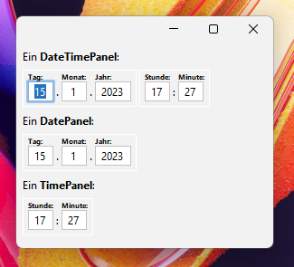

# DateTimePanel

**DateTimePanel** ist eine Swing-Komponente, mit der ich in meinen Swing-Anwendungen Datums- und
Zeiteingaben erfasse und anzeige.

**Genau genommen handelt es sich um 3 Komponenten:**

* DateTimePanel
* DatePanel
* TimePanel

## Screenshots

Hier ein Screenshot mit deutscher Locale:



Hier ein Screenshot mit us-amerikanischer Locale:


Alles != deutsche Locale wird so angezeigt.

Die Übersetzung,
die Anordnung der Felder, das Trennzeichen und das 12-Stundenformat
sind über ein Resource Bundle konfigurierbar.

## Installation

**Das muss in die pom.xml:**

```xml
<dependency>
    <groupId>de.schipplock.gui.swing</groupId>
    <artifactId>datetimepanel</artifactId>
    <version>0.0.1</version>
</dependency>
```

## Wie verwende ich diese Bibliothek?

**Es wird folgender Import benötigt:**

```java
import de.schipplock.gui.swing.datetimepanel.DateTimePanel;
import de.schipplock.gui.swing.datetimepanel.DatePanel;
import de.schipplock.gui.swing.datetimepanel.TimePanel;
```

**So benutzt man die Komponente:**

```java
var dateTimePanel = new DateTimePanel();
var datePanel = new DatePanel();
var timePanel = new TimePanel();

var localeDateTime = dateTimePanel.getLocalDateTime();
var localDate = datePanel.getLocalDate();
var localTime = timePanel.getLocalTime();
```

**Jedes Panel ruft bei Änderung der Werte auch "zurück", wenn man will:**

```java
dateTimePanel.onChange(() -> {
    if (dateTimePanel.isValidDateTime()) {
        System.out.println("datetime value has changed to: " + dateTimePanel.getLocalDateTime().toString());
    }
});
```

Ein voll funktionierendes Demo habe ich im Testordner abgelegt (`DateTimePanelDemo`).

## License
[Apache License 2.0](https://choosealicense.com/licenses/apache-2.0/)